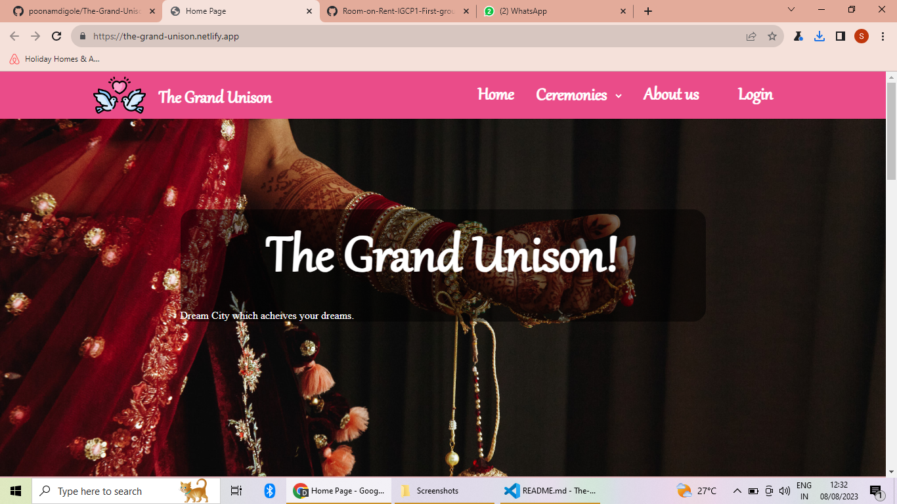
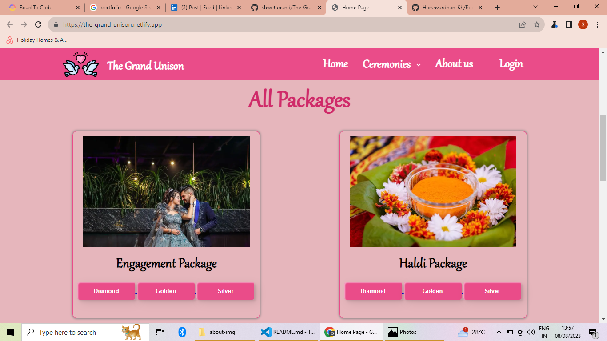
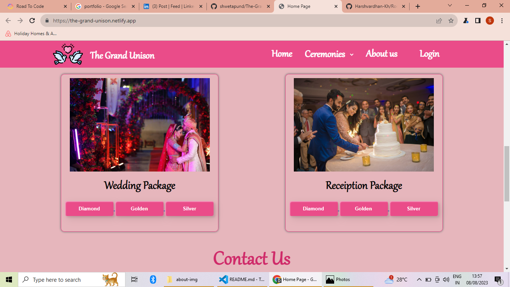

<!-- # The Grand Unison
### We assist with the design, planning and management of a client's events such as Engagement , Haldi, Wedding & Receiption Ceremony.
## Ceremonies :
- Ring Ceremony
- Haldi Ceremony
- Wedding
- Receiption Ceremony

## Contributors :

1. Poonam Digole - Wedding Packages.

2. Kashish  Imandar - Ring Ceremony Packages.

3. Vivek Shejole - Haldi Ceremony Packages.

4. Sweta Pund - Receiption Ceremony Packages.

5. Yogita Shete - Home Page, About Us, Login and Signin -->
# 💏The Grand Unison

## Plan your dream wedding in your budget.
**Homepage**
 

**Packages**

**Book here**

## Use Of Project🏘️🌇

**The Grand Unison** is based on wedding event management.it is specialised platform design tool streamline and enhance the planning and coordination of weddings. It offers a range of features and functionalities that cater specifically to the needs of couples, wedding planners, vendors, and guests. Here are some key uses of this website.
* Centralized Planning Hub
* Vendor Management
* Budget Tracking
* Customization
* Event Schedule

## Description 📝
We have created this project using `HTML` and `CSS`,

 A wedding event management website significantly simplifies the entire wedding planning process, providing a comprehensive and efficient platform for communication, collaboration, and coordination among all stakeholders involved in making the special day a success.

## Real Life Use🎊
**Couples' Planning and Communication:** Couples use these websites to collaborate on planning details such as budgeting, vendor selection, and event schedules
    
**Vendor Selection and Coordination:** Couples and planners can use the website to research and select vendors based on reviews, portfolios, and recommendations.

**Budget Management:** Wedding event management websites often include budgeting tools that allow couples to set a budget, track expenses, and monitor payments to vendors.

**Vendor Collaboration:** Vendors such as florists, photographers, and caterers can access the website to review event details, confirm logistics, and coordinate their services based on the provided timeline.

## Future Scope🔮✨
The future scope of *The  Grand Unison* is promising, with advancements in technology, changing social trends, and the increasing demand for personalized and memorable experiences

## Contributors 👏

